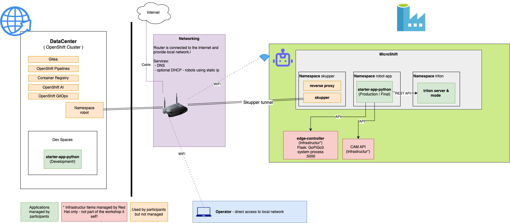

# Cloud Native Robotz Hackathon - Infrastructure

> 🤖 Complete infrastructure provisioning and automation for the Cloud Native Robotz Hackathon event

## Table of Contents

- [Overview](#overview)
- [Architecture Components](#architecture-components)
- [Network Configuration](#network-configuration)
  - [IP Address Allocation](#ip-address-allocation)
  - [WiFi Setup](#wifi-setup)
- [Robot Inventory](#robot-inventory)
- [Getting Started](#getting-started)

## Overview

This repository contains all infrastructure components needed to set up and manage the Cloud Native Robotz Hackathon environment. The setup includes a complete OpenShift-based infrastructure spanning from datacenter training environments to edge gateways and individual robot configurations.

## Architecture Components

| Component | Description | Purpose |
|-----------|-------------|---------|
| **[datacenter/](datacenter/)** | Main OpenShift Cluster for training and development | Provides the central hub for AI/ML workloads, data processing, and participant development environments |
| **[edge-gateway/](edge-gateway/)** | Single Node OpenShift to manage all robots | Acts as the edge computing gateway, coordinating robot fleet management and local processing |
| **[robot/](robot/)** | Robot provisioning and configuration management | Contains all scripts, services, and configurations for individual robot setup and maintenance |
| **[automation/](automation/)** | End-to-end automation and orchestration | Ansible playbooks and automation scripts for final configuration and robot fleet automation |

## Network Configuration

### Network Details

- **Network Range**: `192.168.8.0/24`
- **Gateway**: `192.168.8.1`
- **DNS Server**: `192.168.8.1`

### IP Address Allocation

| IP Range | Assignment | Description |
|----------|------------|-------------|
| `192.168.8.1` | GL-AXT1800 Router/Access-Point | Main network gateway and wireless access point |
| `192.168.8.2` | Edge Gateway | Single Node OpenShift cluster • `edge-gateway.lan` • `*.apps.edge-gateway.lan` • `api.edge-gateway.lan` • `api-int.edge-gateway.lan` |
| `192.168.8.100-149` | Robot Fleet | Static IP assignments for hackathon robots [📋 See Robot Inventory](#robot-inventory) |
| `192.168.8.150-249` | DHCP Pool | Dynamic IP allocation for participant devices |

### WiFi Setup

| Setting | Value |
|---------|-------|
| **SSID** | `robot-hackathon-78b09` |
| **WiFi Password** | *Stored in Red Hat internal password manager* |
| **Router Admin Password** | *Stored in Red Hat internal password manager* |

> ⚠️ **Note**: WiFi credentials are securely stored in the Red Hat internal password management system for security purposes.

## Robot Inventory

The complete robot inventory, including IP assignments, hardware specifications, and current status, is maintained in our centralized tracking system:

📊 **[Robot Inventory Spreadsheet](https://docs.google.com/spreadsheets/d/1HIwmvbSDCddMpYYcYuls53cX771A9UED9M1vFjI9NCs/edit#gid=0)**

This spreadsheet contains:
- Individual robot IP assignments (192.168.8.100-149 range)
- Hardware configuration details
- Current operational status
- Team assignments during hackathon events

## Getting Started

1. **Prerequisites**: Ensure you have access to the required credentials and network access
2. **Datacenter Setup**: Begin with the [datacenter/](datacenter/) components for the main cluster
3. **Edge Gateway**: Configure the [edge-gateway/](edge-gateway/) for robot management
4. **Robot Configuration**: Use [automation/](automation/) playbooks for robot fleet setup
5. **Individual Robots**: Follow [robot/](robot/) documentation for specific robot configurations

For detailed setup instructions, refer to the README files in each component directory.
