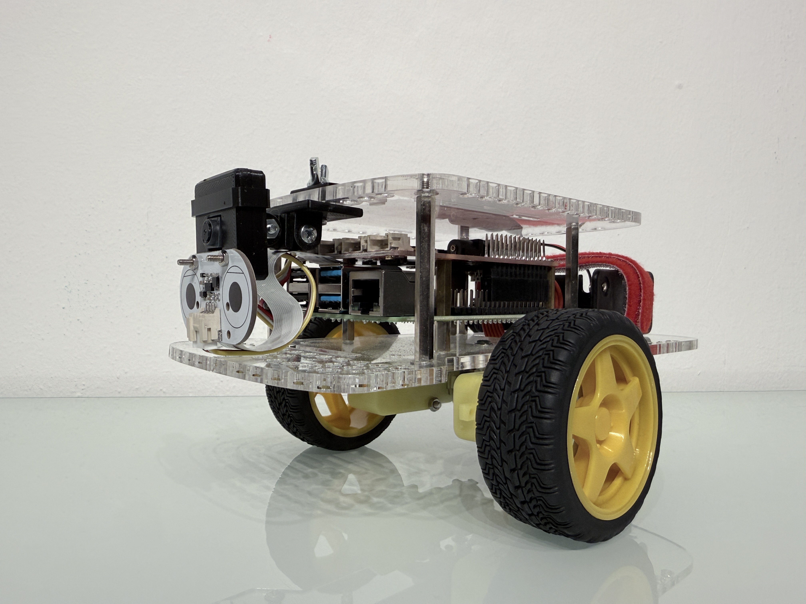
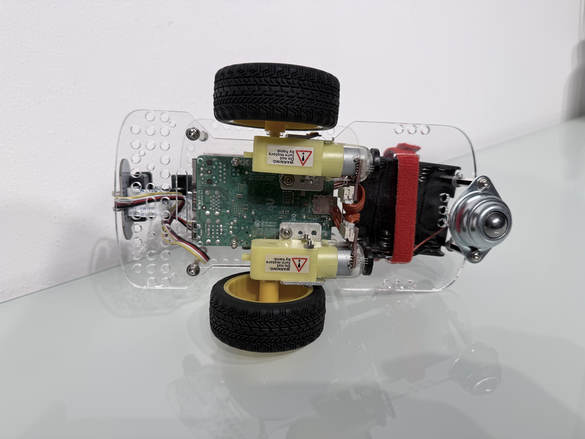
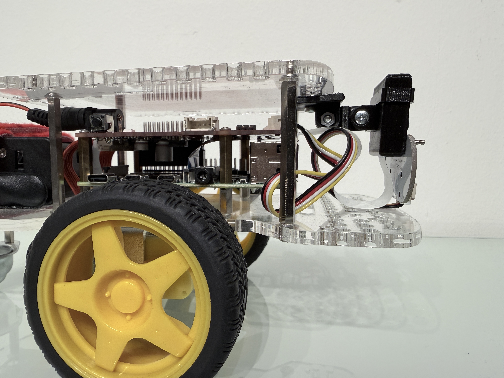
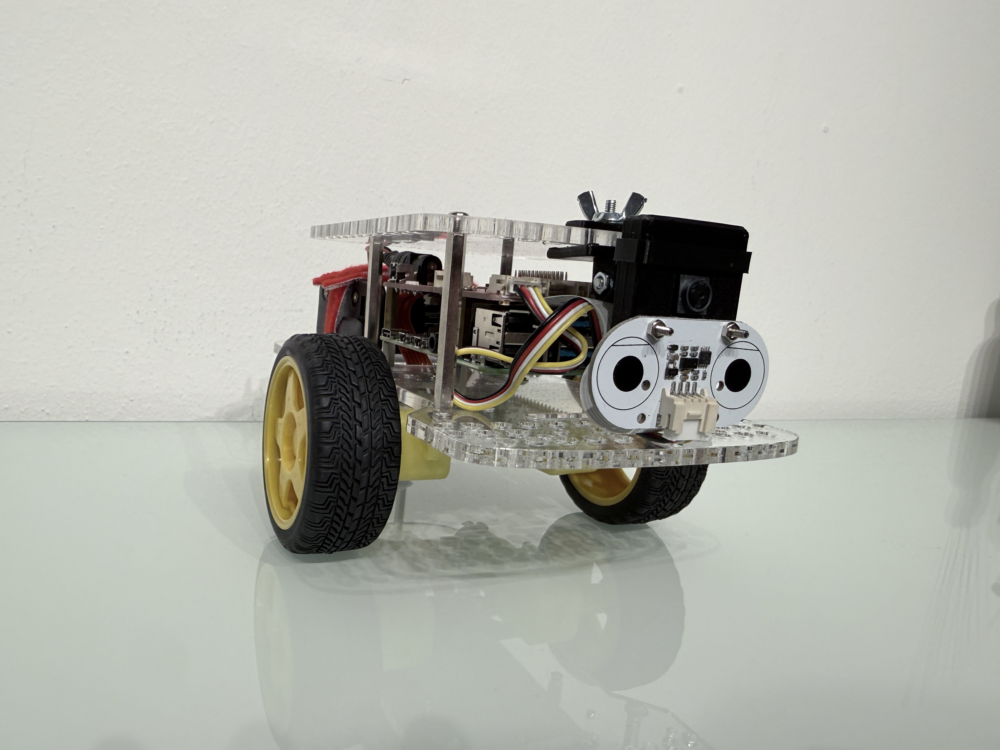
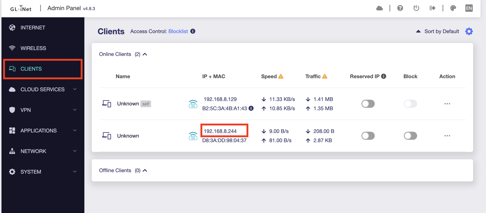
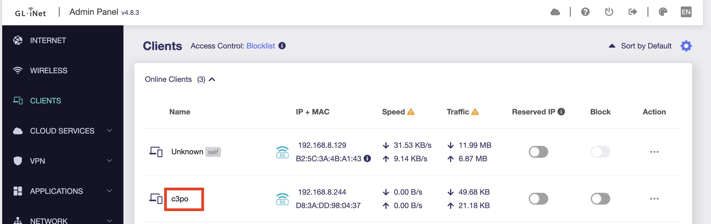
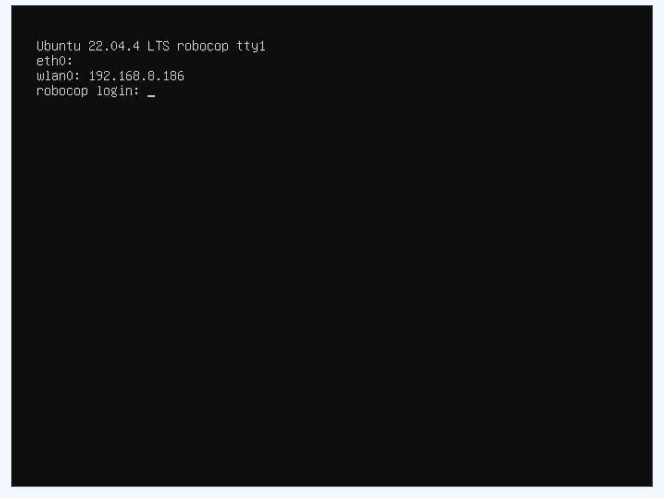

## BOM

|Name|Example Shop Link|
|---|---|
|**GoPiGo Kit**|<https://gopigo.io/gopigo/>|
|**Raspberry Pi 4 B - 8 GB Memory Version**|<https://www.berrybase.de/en/raspberry-pi-4-computer-modell-b-8gb-ram>|
|**Raspberry Pi Camera Modules v2**|<https://www.berrybase.de/en/raspberry-pi-camera-module-8mp-v2>|
|**SD Card**<br/> * 128 GB recommended<br/> * 64 GB minimum |<https://www.berrybase.de/en/sandisk-extreme-microsdxc-a2-uhs-i-u3-v30-190mb-s-speicherkarte-adapter-128gb>
|**3D Printed Camera Mounts**<br>🛠️ custom, **you have to print it.**|<https://github.com/cloud-native-robotz-hackathon/3dprint-parts>|
|**WiFi Router**, optional but recommended|<https://store-eu.gl-inet.com/collections/new-arrivals/products/flint-3-gl-be9300-tri-band-wi-fi-7-home-router>

It is roughly 350 Euro per robot + 200 Euro the optional WiFi router.

## Pictures

{ width="150" }
{ width="150" }
{ width="150" }
{ width="150" }

## Setup Robot from Scratch

This should only be neccessary with a new robot or when repairing/updating/replacing a robot.

### Step 1) Install image

* Download latest image Ubuntu 22.04, Microshift 4.8 from: <https://drive.google.com/drive/folders/1huFhZTknLdMx4BAWrlbNhOonxboOjHLn>
* Write to SD Card, will be resized to SD Card size at first boot
    ```shell
    gunzip robot-hackathon-image.<version>>.img.gz
    sudo dd if=robot-hackathon-image.<version>.img of=/dev/sdXXX status=progress
    ```
* The image will be resized to SD card size on first boot
* The image is preconfigured with:
    * Automatic connection to the hackathon WIFI "robot-hackathon-78b09", password in Bitwarden collection.
    * Robot hackathon SSH key (Bitwarden Collection)

### Step 2) Network & Hostname configuration

* Boot robot with new image
* Go to Wifi router Admin page: <https://192.168.8.1> (Admin password is stored in Bitwarden, collection `Robot hackathon` item `Wifi router admin access`)
    * Navigate to "CLIENTS", findout new "Unknown" IP address:

        {width=1024}

* Connect to the robot to configure the hostname:

    ```shell
    ssh -i ~/.ssh/robot-hackathon -l root 192.168.8.<REPLACE IP>
    ```

    Optional check via camera where you are:

    ```
    curl -L -O https://raw.githubusercontent.com/cloud-native-robotz-hackathon/infrastructure/refs/heads/v3/robot/lights-on.py
    chmod +x ./lights-on.py
    ./lights-on.py
    ```

    (If available) open via Browser: `http://192.168.8.<REPLACE IP>:8000/testimage.jpg`

    Change hostname and reboot via:

    Pick robot name aka hostname from the [nine robot travel kit](../nine-robot-travel-kit/#list-of-robots) or choose your own. When choosing your own make sure to update the env robot mapping in the provisioning form and the ansible inventory

    ```shell
    hostnamectl set-hostname <REPLACE_ROBOT_NAME>
    reboot
    ```

* Now the robot should appear with the right hostname aka robot name

    {width=1024}

* Toggle/Enable the "Reserved IP" switch

### Step 3) Finish configuration via ansible

To finish the configuration, you have to run a number of Playbooks against the robot(s) from your laptop.

Clone the GitHub repo [infrastructure](https://github.com/cloud-native-robotz-hackathon/infrastructure.git).

```shell
git clone https://github.com/cloud-native-robotz-hackathon/infrastructure.git
cd infrastructure/
```

The Playbook `automation/bootstrap-robot.yaml` does the following steps:

- Ensures the robot is running [latest](https://github.com/cloud-native-robotz-hackathon/infrastructure/blob/main/automation/bootstrap-robot.yaml#L19-L23) image before proceeding.
- Clones and installs edge-controller in a specified version from GitHub to /opt/edge-controller.
- Clones and installs robot-config-service in a specified version from GitHub to /opt/robot-config-service.
- Configures, enables, and restarts the edge-controller systemd unit and makes sure it runs.
- Updates /etc/issue (login banner), /etc/hosts, and sets the system hostname to match the inventory.

Create the vars file with the connection details and run the Playbook. You can get these values from the Readme in the referenced Github repo and the Bitwarden vault.

```shell
cd automation/

echo "rcs_git_repo: https://github.com/cloud-native-robotz-hackathon/robot-auto-register-78b09.git" > group_vars/all/robot-config-service.yaml
echo "rcs_gh_token: github_pat_xxx" >> group_vars/all/robot-config-service.yaml
echo "rcs_hubcontroller_user: hub-controller" >> group_vars/all/robot-config-service.yaml
echo "rcs_hubcontroller_password: hub-controller" >> group_vars/all/robot-config-service.yaml

ansible-navigator run bootstrap-robot.yaml -l <ROBOT_NAME>
```

Then log into the Hubcontroller (<HUBCONTROLLER_URL>/dashboard.html) (username / pass in Bitwarden) and you should see a tile with your registered robot.

## Advanced rarely used topics

### Camera Setup (Raspi camera v2)

Playbook camera-test.yaml is here `camera-test.yaml` to fetch camera image:

```shell
cd automation/
ansible-navigator run ./camera-test.yaml -l gort
```

Open all `camera-test*jpg` files.

Cable orientation: blue “bar” on cable oriented to USB ports, blue bar at camera away from lens

### Custom network configurartion

* The robot will automatically connect to a WIFI with the SSID and key/password listed above.
* If you want to configure another WIFI, attach a network cable and SSH into the robot (root / <PW> from Bitwarden collection) or mount the SD card and change on disk.
* Edit /etc/netplan/50-cloud-init.yaml and add your WIFI access point, reboot or run `netplan apply`. Config example:

    ```
    network:
        ethernets:
            eth0:
                dhcp4: true
                optional: true
        version: 2
        Wifis:
            wlan0:
            access-points:
            "robot-hackathon-78b09":
                password: "PASSWORD"
            "otherssid":
                password: "<PASSWORD>"
            dhcp4: true
    ```
* Reboot the robot

* Now the boot screen should look like this, and show the new IP address
  
